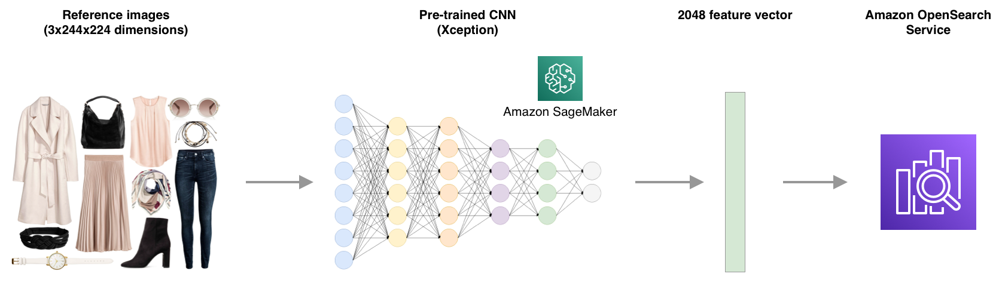
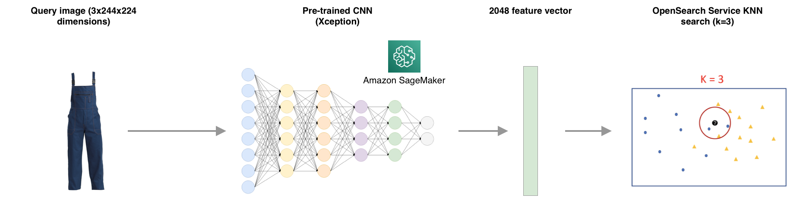
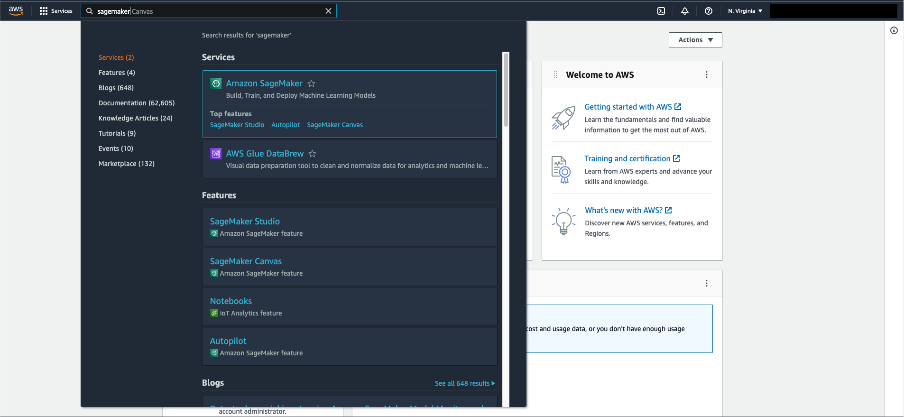
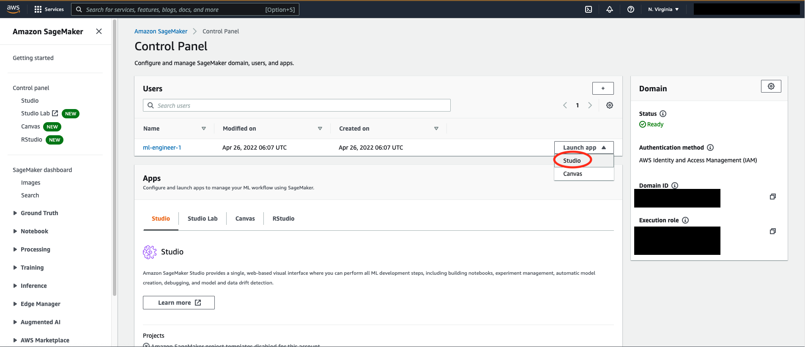
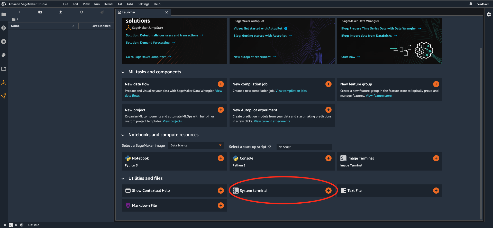
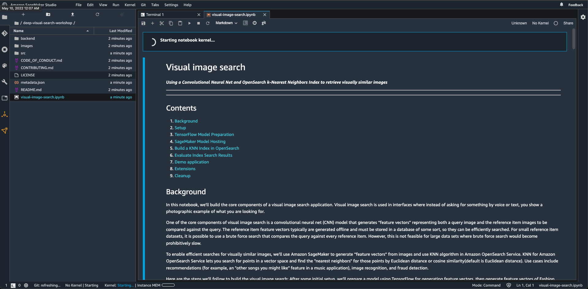
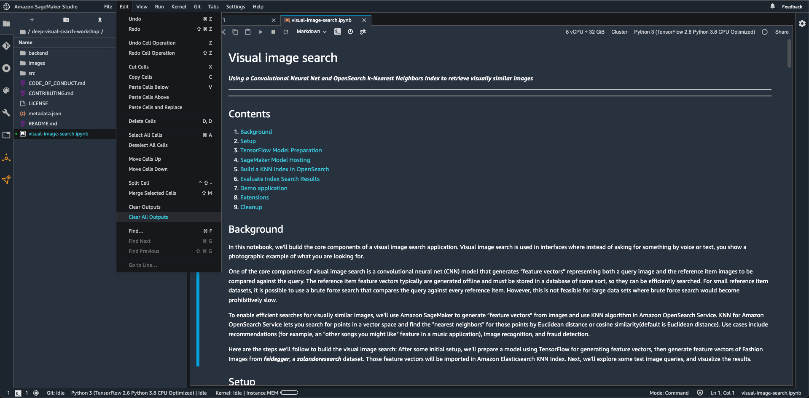
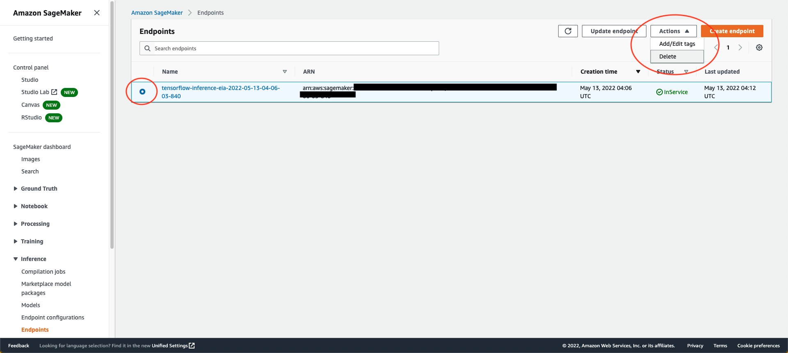
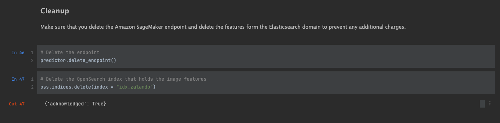

## Welcome to Deep Visual Search Lab
This repository is part of the ANZ Summit 2022 DevLabs to create a visual search application using Amazon SageMaker and Amazon OpenSearch Service

## How does it work?
We will use Fashion Images from feidegger, a zalandoresearch dataset as a reference image to generate a 2048 feature vector using a convolutional neural networks and gets stored into Amazon OpenSearch KNN index



When we present a new query image, it's computing the related feature vector from Amazon SageMaker hosted model and queries Amazon OpenSearch KNN index to find similar images



## Getting started

### If you're using your own AWS account

Use cdk to provision resources by cloning the IaC (Infrastructure as Code) repo and following the instructions there

```
$ git clone https://github.com/aws-samples/deep-visual-search-workshop-infra.git
```

### At an AWS event

1. Open Amazon SageMaker through AWS console.



2. In the Amazon SageMaker console, click on Studio.


3. A user named "ml-engineer-1" is pre-created for you, select Studio from the Launch app selector to launch SageMaker Studio. We'll be using this for the rest of the lab.



4. Once the Jupyter environment is loaded, launch a System Terminal from the Launcher.



5. On the terminal, clone the lab repository.

```
$ git clone https://github.com/aws-samples/deep-visual-search-workshop.git
```

6. Finally, launch ***visual-image-search.ipynb*** from the deep-visual-search-workshop folder. Wait until the kernel is ready.



7. Clear all outputs from the ***Edit*** menu to get a blank slate for this lab.



9. Ensure there are no stale SageMaker endpoints in the account from previous sessions. If you see any endpoints, select and delete through the console. Obviously you don't want to delete the endpoints that you need if you're using a personal account.



10. You're all set! Please follow along the rest of the instruction within the notebook to complete the lab.

## Important

Please don't forget to run the cleanup commands before leaving. These are given in the last cell of the notebook.



## Survey

Thank you for participating in this lab. Please leave us feedback to let us know how we did and for us to improve in future labs. If the QR code below doesn't work, you can click on the link [here](https://eventbox.dev/survey/GZ9V9ZA).


## Security

See [CONTRIBUTING](CONTRIBUTING.md#security-issue-notifications) for more information.

## License

This library is licensed under the MIT-0 License. See the LICENSE file.